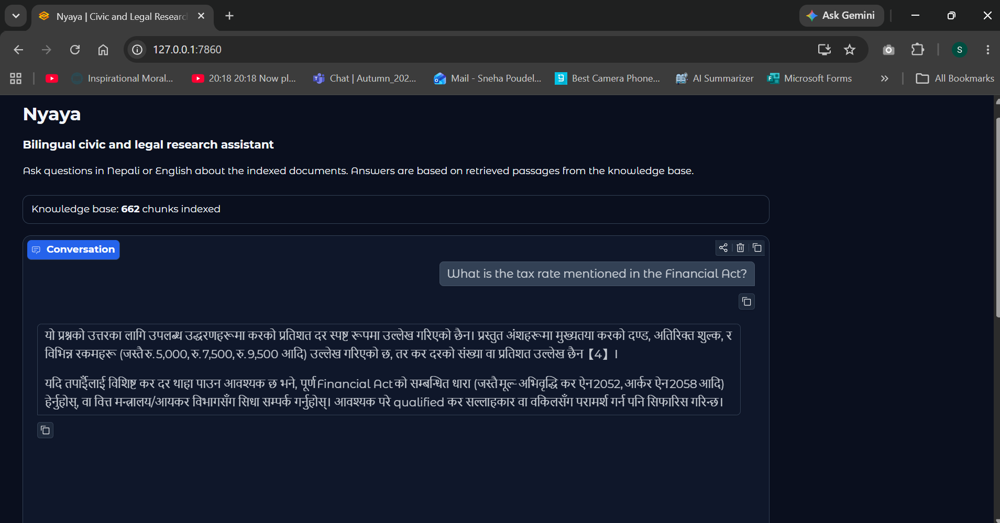

# Nyaya: Bilingual Civic and Legal RAG Assistant



Nyaya is a bilingual research assistant for Nepali civic and legal documents. It can answer questions in Nepali or English by searching the documents in its knowledge base, such as the Constitution, Labour Act, or Company Act. Each answer includes the source passages it used.

It uses `google/embeddinggemma-300m` for local embeddings, ChromaDB for document search, Groq for answer generation, and Gradio for the web interface.

## Prerequisites

- Python 3.10+
- A Groq API key

## Setup

```bash
git clone <this repo>
cd nyaya-rag
python -m venv .venv
source .venv/bin/activate      # Windows: .venv\Scripts\activate
pip install -r requirements.txt

cp .env.example .env
# Add your GROQ_API_KEY to .env
```

## Add documents

Place `.pdf`, `.docx`, `.txt`, or `.md` files in `data/raw/`.

## Build the document index

```bash
python build_index.py
# Rebuild the index from scratch
python build_index.py --reset
```

## Launch the app

```bash
python app.py
```

Open the local URL shown by Gradio, usually `http://127.0.0.1:7860`.

## Project structure

```text
nyaya-rag/
  data/raw/            source documents
  chroma_db/           persistent vector store
  src/
    config.py          paths and retrieval settings
    loaders.py         document loaders
    chunking.py        text splitter
    embeddings.py      embeddinggemma-300m wrapper
    vectorstore.py     ChromaDB wrapper
    llm.py             Groq generation and grounded prompt
    rag_pipeline.py    retrieval and generation orchestration
  build_index.py       indexing command
  app.py               Gradio interface
```

## Notes

- The embedding model uses separate encoders for documents and questions to improve search quality.
- The answer model is instructed to rely on the retrieved passages and cite them.
- Rebuild the index whenever you add, remove, or change source documents.
